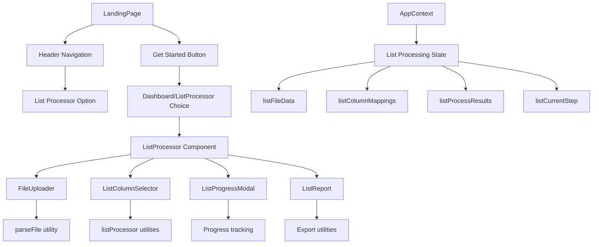
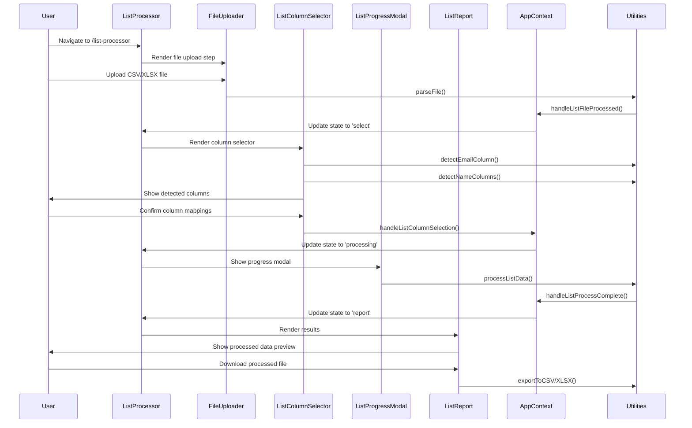

# List Processing Feature Architecture

## System Overview

The list processing feature will be integrated as a separate workflow within the existing email duplicator checker application. It will follow a similar pattern to the duplicate checker but with its own dedicated components and state management.

## Component Architecture



## Data Flow Architecture



## State Management Architecture

### AppContext Extensions

```javascript
// New state properties for list processing
const [listFileData, setListFileData] = useState(null);
const [listColumnMappings, setListColumnMappings] = useState({
  emailColumn: null,
  firstNameColumn: null,
  lastNameColumn: null,
  attributeColumns: []
});
const [listProcessResults, setListProcessResults] = useState(null);
const [listCurrentStep, setListCurrentStep] = useState("upload");
const [listDownloadFormat, setListDownloadFormat] = useState("csv");

// New handler functions
const handleListFileProcessed = useCallback((data) => {
  // Auto-detect columns and set initial mappings
}, []);

const handleListColumnSelection = useCallback((mappings) => {
  // Update column mappings
}, []);

const handleListProcess = useCallback(async () => {
  // Process the data according to mappings
}, []);

const handleListDownload = useCallback(() => {
  // Download processed data
}, []);
```

## Utility Functions Architecture

### listProcessor.js Core Functions

```javascript
// Column Detection
export function detectEmailColumn(columns) {
  // Auto-detect email column using patterns
}

export function detectNameColumns(columns) {
  // Auto-detect firstname/lastname columns
}

// Data Processing
export function processListData(data, mappings, onProgress) {
  // Main processing function with progress tracking
}

export function createNameColumn(row, firstNameCol, lastNameCol) {
  // Create name column from firstname/lastname
}

export function createAttributesJSON(row, attributeColumns) {
  // Create attributes JSON from selected columns
}

// Validation
export function validateEmailColumn(data, columnName) {
  // Validate that selected column contains emails
}

export function validateProcessedData(processedData) {
  // Validate processed data structure
}
```

## File Structure

```
src/
├── components/
│   ├── ListProcessor.jsx           # Main workflow container
│   ├── ListColumnSelector.jsx      # Column mapping interface
│   ├── ListReport.jsx              # Results display
│   ├── ListProgressModal.jsx       # Progress indicator
│   └── common/
│       └── Header.jsx              # Updated with navigation
├── context/
│   └── AppContext.jsx              # Extended with list processing state
├── utils/
│   ├── listProcessor.js            # List processing utilities
│   ├── fileParser.js               # Existing file parsing utilities
│   └── duplicateChecker.js         # Existing duplicate checker
└── styles/
    └── list-processor.css          # List processing specific styles
```

## Routing Architecture

```javascript
// App.jsx routes
<Routes>
  <Route path="/" element={<LandingPage />} />
  <Route path="/dashboard" element={<Dashboard />} />
  <Route path="/list-processor" element={<ListProcessor />} />
</Routes>
```

## UI/UX Architecture

### Step Progression
1. **Upload Step**: File upload with drag-and-drop support
2. **Select Step**: Column mapping with auto-detection and preview
3. **Processing Step**: Progress tracking with time estimates
4. **Report Step**: Results preview with download options

### Responsive Design
- Mobile-first approach
- Consistent with existing black/white theme
- Smooth transitions between steps
- Progress indicators for large files

### Error Handling
- File format validation
- Column detection feedback
- Processing error recovery
- User-friendly error messages

## Performance Considerations

### Large File Handling
- Streaming processing for large files
- Progress tracking with time estimates
- Memory-efficient data processing
- Background processing with Web Workers (future enhancement)

### Optimization Strategies
- Debounced column detection
- Efficient JSON stringification
- Optimized CSV/XLSX export
- Lazy loading of components

## Security Considerations

### Data Privacy
- Client-side processing only
- No server data transmission
- Secure file handling
- Memory cleanup after processing

### Input Validation
- File type validation
- Column name sanitization
- Data size limits
- Malicious file protection

## Testing Strategy

### Unit Tests
- Utility function testing
- Column detection accuracy
- Data transformation validation
- Edge case handling

### Integration Tests
- Complete workflow testing
- File upload/download testing
- State management testing
- Error scenario testing

### User Acceptance Tests
- Various file formats
- Different column structures
- Large file processing
- Mobile device testing