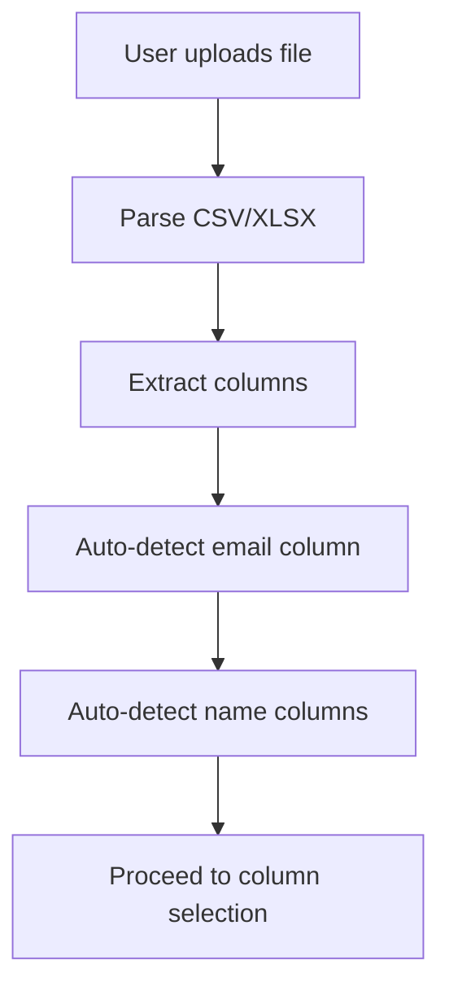
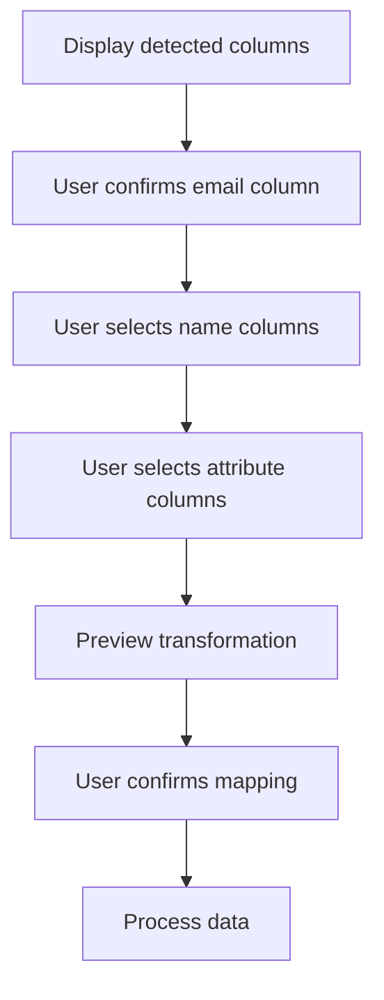
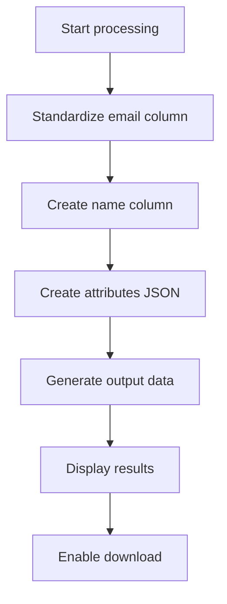

# List Processing Feature Implementation Plan

## Overview
This plan outlines the implementation of a new list processing feature for the email duplicator checker application. The feature will allow users to transform email lists by standardizing the format with email, name, and attributes columns.

## Feature Requirements
1. Upload CSV/XLSX files containing email lists
2. Transform the data to the format: `email,name,attributes`
3. Rename email column to "email" (standardization)
4. Create a name column from firstname/lastname columns
5. Create an attributes column containing all other data as JSON
6. Allow users to select which columns to move to attributes
7. Export the transformed data in CSV or XLSX format

## Architecture

### Component Structure
```
src/components/
├── ListProcessor.jsx           # Main container for list processing workflow
├── ListColumnSelector.jsx      # Column mapping and selection interface
├── ListReport.jsx              # Results display and export options
├── ListProgressModal.jsx       # Processing progress indicator
└── common/
    └── Header.jsx              # Updated with navigation to list processor
```

### Utility Functions
```
src/utils/
└── listProcessor.js            # Core list processing logic
```

### State Management
The existing AppContext will be extended to handle list processing state:
- `listFileData`: Uploaded file data
- `listColumnMappings`: User selections for column mapping
- `listProcessResults`: Processed data results
- `listCurrentStep`: Current workflow step
- `listProgressState`: Processing progress tracking

## Data Flow

### 1. File Upload Flow


### 2. Column Selection Flow


### 3. Data Processing Flow


## Component Details

### ListProcessor Component
- Main workflow container similar to Dashboard
- Manages step progression: upload → select → report
- Handles error states and progress tracking
- Integrates with existing AppContext

### ListColumnSelector Component
- Displays detected columns with auto-selections
- Allows users to confirm/modify column mappings
- Shows live preview of transformation
- Handles special cases (missing name columns, etc.)

### ListReport Component
- Displays processing statistics
- Shows before/after data preview
- Provides download options (CSV/XLSX)
- Includes option to process another file

### ListProgressModal Component
- Shows processing progress for large files
- Displays current operation status
- Provides estimated time remaining

## Utility Functions

### listProcessor.js Core Functions
```javascript
// Process the uploaded data according to user selections
export function processListData(data, mappings) {
  // Implementation details
}

// Auto-detect email column from available columns
export function detectEmailColumn(columns) {
  // Implementation details
}

// Auto-detect name columns (firstname, lastname)
export function detectNameColumns(columns) {
  // Implementation details
}

// Create name column from firstname/lastname
export function createNameColumn(row, firstNameCol, lastNameCol) {
  // Implementation details
}

// Create attributes JSON from selected columns
export function createAttributesJSON(row, attributeColumns) {
  // Implementation details
}
```

## Implementation Steps

1. **Create ListProcessor Component**
   - Set up basic component structure
   - Implement step navigation
   - Add error handling

2. **Create ListColumnSelector Component**
   - Build column detection UI
   - Implement selection logic
   - Add preview functionality

3. **Create ListReport Component**
   - Design results display
   - Implement download functionality
   - Add statistics display

4. **Create ListProgressModal Component**
   - Build progress indicator UI
   - Implement progress tracking
   - Add cancellation option

5. **Implement Utility Functions**
   - Write core processing logic
   - Add column detection algorithms
   - Implement data transformation

6. **Update AppContext**
   - Add list processing state
   - Implement action handlers
   - Add progress tracking

7. **Update Routing**
   - Add /list-processor route
   - Update navigation components
   - Ensure proper redirects

8. **Style Components**
   - Apply consistent styling
   - Ensure responsive design
   - Add animations and transitions

9. **Test Workflow**
   - Test with various file formats
   - Test edge cases
   - Verify export functionality

## Edge Cases to Handle

1. **Missing Email Column**
   - Display error message
   - Allow user to manually select email column

2. **Missing Name Columns**
   - Create empty name column
   - Allow user to select alternative name columns

3. **Large Files**
   - Implement progress tracking
   - Add processing time estimates
   - Provide feedback during processing

4. **Invalid Data**
   - Handle malformed CSV/XLSX files
   - Validate email formats
   - Handle empty rows gracefully

## Success Metrics

1. **Functional Requirements**
   - Successfully process CSV/XLSX files
   - Correctly transform data to required format
   - Export data in original format

2. **Performance Requirements**
   - Process files with 10,000+ rows efficiently
   - Provide progress feedback for large files
   - Complete processing within reasonable time

3. **User Experience**
   - Intuitive interface for column selection
   - Clear preview of transformations
   - Helpful error messages and guidance

## Future Enhancements

1. **Advanced Column Detection**
   - AI-powered column type detection
   - Support for more name column patterns
   - Automatic attribute categorization

2. **Batch Processing**
   - Process multiple files at once
   - Apply same mapping to multiple files
   - Batch export functionality

3. **Data Validation**
   - Email format validation
   - Duplicate detection within processed data
   - Data quality scoring